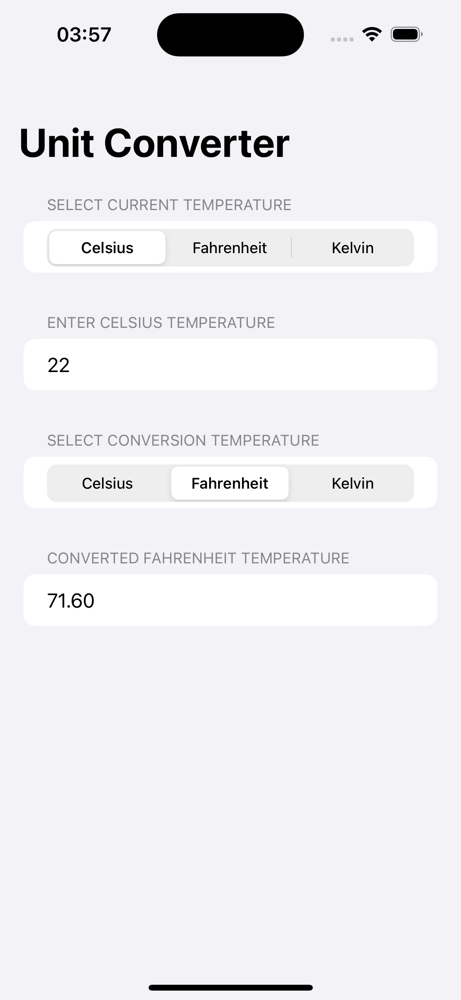
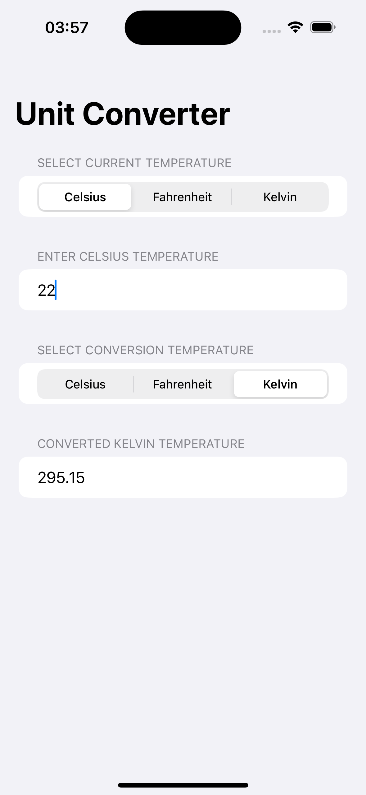
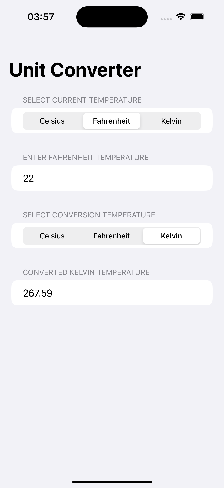
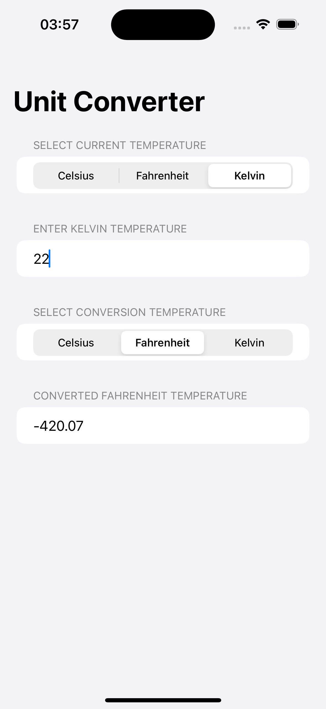

# Unit Converter

## Technologies Used

- Swift programming language for iOS development.
- Auto Layout for responsive design.

## Select Current Temperature

Choose the current temperature unit:

- Celsius
- Fahrenheit
- Kelvin

## Enter Temperature

Enter the temperature in the selected unit.

## Select Conversion Temperature

Choose the temperature unit for conversion:

- Celsius
- Fahrenheit
- Kelvin

## Converted Temperature

The converted temperature will be displayed here.

## Screenshots

